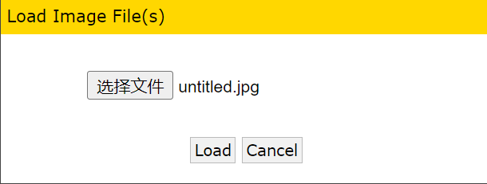
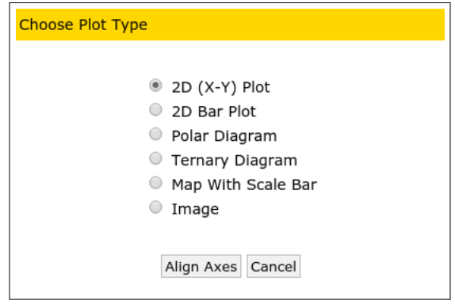
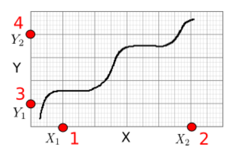
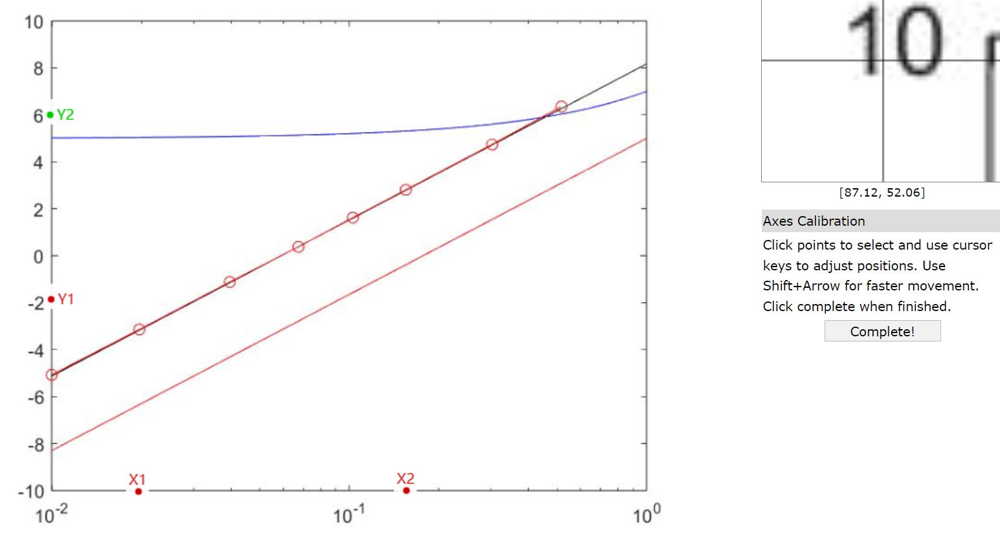
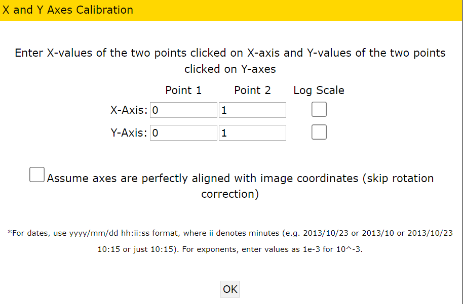
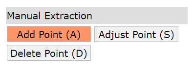
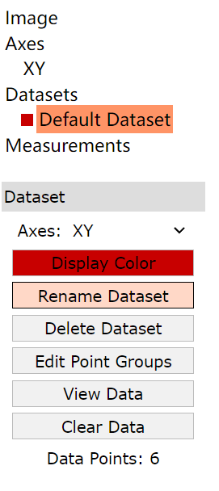
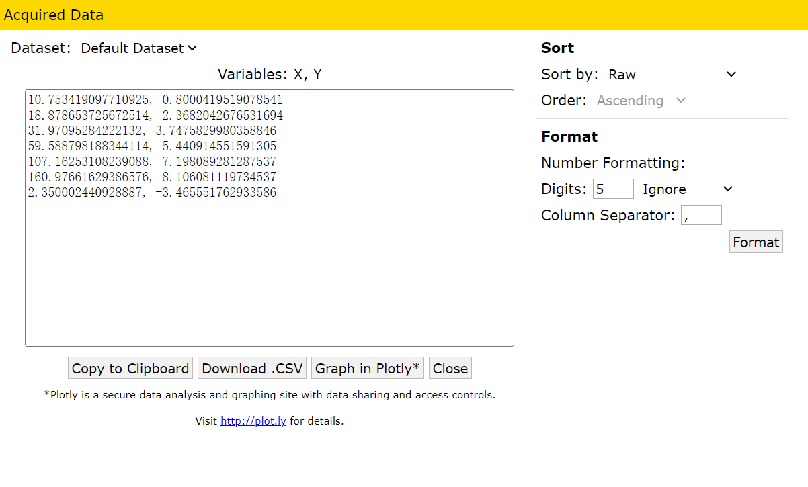

## WebPlotDigitizer使用教程

WebPlotDigitizer是一款可以从图片中提取数据的软件，支持在线使用和pc下载本地使用。

官网网址为：[WebPlotDigitizer - Extract data from plots, images, and maps (automeris.io)](https://automeris.io/WebPlotDigitizer/)

下面以网页版为例，展示如何使用：

1.加载目标图片

File Menu → Load Image:  选择目标图片.

。

2.指定坐标轴类型

选择图片中的坐标轴类型，这里以 2D(X-Y) 为例。

。

接着按如图所示，按要求点击4个点，以此确定横纵坐标，尽量避免所选取的点靠得太近影响软件建立坐标轴的精确性。

tip：使用方向键可以对选取的点微调。

。

。

完成之后点击 `complete`

。

之后输入这4个点在坐标轴上的值。若是对数坐标轴，则还需选择`Log Scale`。

若是输入指数则应该表示如1.45e-10 的形式。避免输入分数形式。

 

3.提取数据(手动)

通过点击鼠标在你想要的目标曲线上取点，软件会将提取该点的数据值。

。

右边菜单中，

Adjust point 可以调节已选取点的位置。

Delete point 则是可以删除已选取点。

左边菜单中，

Clear Points 是清除所添加的全部点。

View Data  可以查看已选点所提取的数据并导出，该数据与所选点的顺序一一对应。

。 

获取数据后，可以输入原始数据，可以在右边 Sort 选择按什么顺序排列。有了数据就可以画图了。

。。

更多的使用教程请查看官网的教程。

