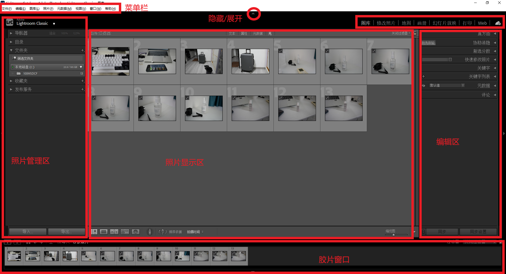
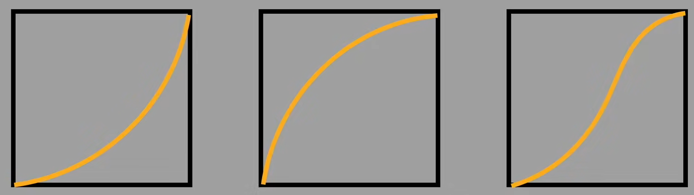
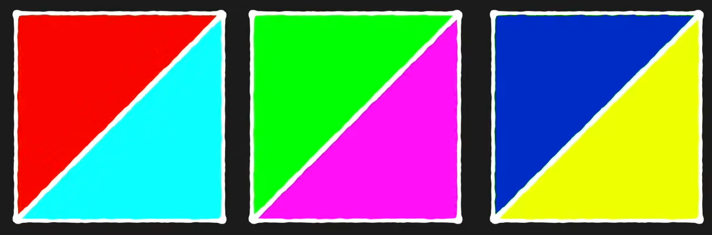

# Lightroom基础教程

## 基础界面

### 界面分区

如图所示，界面从上到下可以划分为5块区域：

- 菜单栏

- 导航栏

- 照片管理区、照片显示区、编辑区

- 胶片窗口

tips：可以在导航栏、菜单栏、信息栏中，右键取消用不到的选项，使整个界面更整洁。

### 导航栏

导航栏中只有两个模式常用：

- `图库` 模式：观看浏览照片或粗略编辑
- `修改照片` 模式：对照片进行详细编辑 

### 管理区

导入照片：

- **图库模式**：导航栏选择在图库模式
- **导入**：选择文件夹照片，选择添加，选择导入
- **文件夹**：显示导入的照片所在的文件夹
- **收藏夹**：选择相应的多个照片，点击 `+` 创建收藏夹，相应的照片将被归类为该收藏夹。

### 显示区

对比两张照片（图库模式）：

- 标记：选择照片，右键设置色标、星级等标记信息

- `X|Y` ：显示区分别显示指定的两个照片。

对比修改前后的照片（修改照片模式）

- `Y|Y`：显示区中分别显示修改前和修改后的照片

### 编辑区（核心）

#### 图库模式（快速修改多张照片）

- 可以统一修改选中照片的白平衡、色调等。
- 右侧的 “元数据” 面板切换成 “EXIF”可以看到包括焦段在内的所有详细参数。

tip：`shift` + 点击一张图 + 点击另一张图，可以选中两张照片之间的所有图。

#### 修改照片模式（精修单张照片）

详情见下一部分。

### 胶片窗口

- 过滤器：筛选做了标记的照片

## 编辑区（修改照片模式）

注意：

- 在Lightroom中修图，软件会实时、自动记录在它的目录数据库里，直接关掉软件，下次打开，所有修改都还在。
- 在LR中修图不会改变原文件，修好的照片需要通过 `文件` → `导出` ，得到JPEG格式的照片。
- 如果想要RAW格式，则选择 `将元数据存储到文件`（Ctrl+S），LR会将最终的变化记录到`.XMP`文件中。LR打开时会自动读取XMP，把色温、曲线、裁剪等所有调整直接应用在RAW上。
- 如果整张照片连同修图历史一起打包成LR专用的 `.lrcat` 目录文件，则用LR打开这个目录时，不仅能看最终效果，还能在“历史记录”面板里看到从第一步到最后一步的所有操作。

### 直方图

显示照片明暗、彩色等信息。

黑白直方图：

- 横坐标：0-255的亮度级别
- 纵坐标：该亮度级别下，像素数量的多少

含义：每个像素的加权平均值（红30% + 绿59% + 蓝11%）的分布，反映整体曝光、对比度。

彩色（RGB）直方图：

- 横坐标：0-255的亮度级别
- 纵坐标：颜色的该亮度级别下，像素数量的多少

黑白直方图是彩色直方图的加权平均（通常是30%红 + 59%绿 + 11%蓝），即黑白直方图 = 把彩色照片转成黑白之后，再统计亮度分布。

含义：由每个像素的R、G、B各自的值的分布，显示红、绿、蓝三个通道各自的亮度分布，反映颜色通道溢出、画面偏色的情况。

### 其他

- 编辑
- 裁剪
- 移除
- 红眼矫正
- 蒙版

### 基本

- 自动、黑白、HDR：
  - 自动：软件自动算出一套它认为“最平衡”的曝光、对比度、高光、阴影、白色色阶、黑色色阶这六个滑块的具体数值。（新手可以以此为基础进行调整）
  - 黑白：颜色到灰度的转换开关。把彩色照片转为黑白，但你可以控制“红色变成深灰还是浅灰”。
  - HDR：这是一个专门处理高反差场景的“一键压高光提阴影”工具。点击后，LR会自动把高光大幅压低、阴影大幅提亮，同时调整对比度和饱和度，让画面中所有细节都能清晰可见。
- 白平衡：色温+色调（Tint）
- 曝光度：调整画面的整体亮度
- 对比度：同时调整画面的高光和暗部；对比度增加则画面亮暗的差别明显。
- 高光/阴影/白色色阶/黑色色阶：调整原画面中（直方图）某一亮度范围的亮暗。即将这个范围的像素在这个范围内进行重新排布。
  - 白色色阶（最亮）--- 高光（次亮）--- 阴影（次暗）--- 黑色色阶（最暗）

### 色调曲线 

目的：调节直方图

#### 直方图曲线

横坐标是原直方图，纵坐标是新直方图。

**直方图曲线（色调曲线）**：将原片的直方图映射到另一个直方图，即两者的映射函数。调节曲线可以得到不同的新直方图。

**三种最简单的色调曲线**：

- 左一：画面整体压暗
- 中间：画面整体提亮
- 右一：亮部提亮，暗部压暗，提高对比度。

注：曲线是线性直线时，则新旧直方图完全一样。

#### 曲线调色原理

一张照片是由三种颜色（RGB）叠加而成的。

可以通过调整某一色片的直方图，进而调整画面的整体色彩。

- 提亮整个红色曲线，则整个画面偏红；压暗整个红色曲线，则整个画面偏青蓝色（互补色）。
- 提亮红色色片的亮部、压暗阴影，则画面的高光位置更蓝，阴影位置更偏青蓝色。
- 优点：可以精确选择范围
- 缺点：赋予色彩需要通过RGB调节，不够精确

互补色（如下图）：

- 红色---青蓝色
- 绿色---洋红色（品红）
- 蓝色---黄色

调色思路：

1. 色温
2. 色调
3. 曝光
4. 二次构图

### 分离色块

对高光/阴影部分，赋予不同的色彩。

- 优点：精确赋予不同的色彩，不用自己调节RGB数值。
- 缺点：只适用于一大片区域，如高光、阴影；无法精确选择任意范围。

### HSL/混色器

（色相、饱和度、明度）

