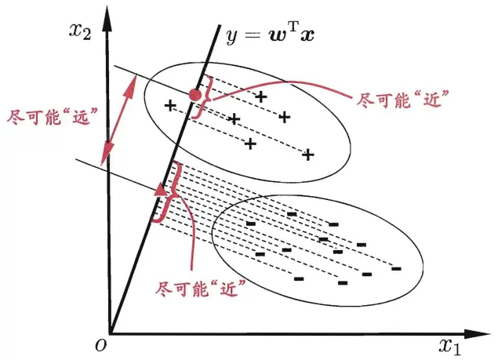

西瓜书《机器学习》

## 线性模型

机器学习是一种人工智能方法，它让计算机通过分析大量数据，自动发现其中的模式和规律，并用来做预测或决策。简而言之，就是让计算机找到一个函数，这个函数能够反映或解决我们关心的问题。

下面介绍机器学习中的一种模型或者方法——线性模型。

线性模型假设模型的输出$y$（我们关心的量）是输入特征$\mathbf{x}$（我们已有的相关数据）的线性组合：
$$
y=\mathbf{w}\cdot \mathbf{x} + b,
$$
其中$\mathbf{w},b$是通过训练学习得到的模型参数，$\mathbf{w}$反映了表示各个特征的重要性。

**缺点**：表达能力有限，只能拟合线性关系，当特征之间存在强非线性关系时表现差。

**分类**：根据使用的**损失函数**和**任务目标**不同，线性模型可以细分成不同的类型。

- 线性回归：线性模型 + 均方误差，回归任务。
- 逻辑回归：线性模型 + Sigmoid + 对数损失（log loss），分类任务。
- 线性判别分析：线性模型 + 最大类间距离、最小类内距离（判别准则），分类 + 降维任务。
- 线性支持向量机：线性模型 + Hinge Loss + 最大间隔，分类任务。

----

### 线性回归模型

假设我们有 $m$ 个样本，每个样本 $\mathbf{x}$ 有 $n$ 个特征，$\mathbf{x}=[x_1,\cdots,x_n]$。

**模型假设**：每个样本所对应的预测 $\hat{y}$ 为：
$$
\hat{y}=\mathbf{w}\cdot \mathbf{x} + b,
$$
**目标**：是希望模型给出的预测 $\hat{y}$ 尽可能接近真实值 $y$。

**损失函数**：
$$
L(\mathbf{w},b) = \frac{1}{2m}\sum_{i=1}^m (y_i - \hat{y}_i)^2
$$
线性回归使用**均方误差（MSE）**作为损失函数，它表示所有样本预测与真实值的平均偏差，其中，下标 $i$ 表示第 $i$ 个样本，系数$1/2$是为了计算方便。

基于均方误差最小化进行模型求解的方法称为“最小二乘法”。在线性回归中，最小二乘法就是找到一条直线，是所有样本到直线上的欧式距离之和最小，所求解得到的$\mathbf{w},b$称为最小二乘“参数估计”。

**最优解**：

- **解析解**：通过对损失函数 $L(\mathbf{w},b)$ 求导，我们可以得到极值点（**最优解**$\mathbf{w}^*$），
  $$
  \mathbf{w}^* = (X^\top X)^{-1} X^\top y
  $$
  这里 $X = [\mathbf{x}_1;\cdots; \mathbf{x}_m]$，第$i$行是样本$\mathbf{x}_i$，并且假设 $X^\top X$ 是可逆的。

- **数值解**：若样本太多，计算逆矩阵太慢，可以使用**梯度下降**逼近最优解。

$$
\mathbf{w} \to \mathbf{w} -\eta\cdot \nabla_w L\\
b \to b -\eta\cdot \nabla_b L
$$

**补充**：从最大似然估计角度理解均方误差。

我们有一组训练数据，$\{(\mathbf{x}_i,y_i)\}_{i=1}^m$，其中每个样本满足：
$$
y = \mathbf{w'}\cdot \mathbf{x}_i + b' + \epsilon_i
$$
其中，$\mathbf{w'},b'$是真实的线性关系，固定但未知，$\epsilon_i$ 是噪声项，满足高斯分布，且独立同分布，$\epsilon\sim \mathcal{N}(0,\sigma^2)$。

在线性回归中，我们假设预测 $\hat{y}$ 与样本特征 $\mathbf{x}$ 之间是线性关系：
$$
\hat{y} = \mathbf{w}\cdot \mathbf{x} + b
$$
其中，$\mathbf{w},b$是模型参数，是待估计参数，我们希望估计 $\mathbf{w},b$ 是逼近真实的 $\mathbf{w'},b'$。

用现在的模型参数进行真实模拟生成数据，得到输出是带有噪声的，$\hat{y}+\epsilon$，是一个随机数，满足 $\sim \mathcal{N}(\hat{y},\sigma^2)$。

如果现实中真的是这么一个模型生成的，那观察到标签 $y$ 出现的概率是多少？这相当于问 $y=\hat{y}+\epsilon$ 的概率是多少，也等价于 $\epsilon=y-\hat{y}$ 概率。而噪声项是满足高斯分布的，因此得到：
$$
P(y|\mathbf{x};\mathbf{w},b) = P(\epsilon) = \frac{1}{\sqrt{2\pi\sigma^2}}\exp(-\frac{(y-\hat{y})^2}{2\sigma^2})
$$
整个训练数据集的似然函数为：
$$
\Pi(\mathbf{w},b) = \prod_{i=1}^m P(y|\mathbf{x};\mathbf{w},b)
$$
为了更方便优化，取对数：
$$
\log\Pi(\mathbf{w},b) = \sum_{i=1}^m \left[ \frac{1}{2}\log(2\pi\sigma^2) - \frac{(y_i-\hat{y}_i)^2}{2\sigma^2}  \right]
$$
如果模型参数越接近真实参数，那么越可能观察到训练的这组数据，因此，最大化似然函数，估计模型参数。

可以看到，最大化似然函数 $\log\Pi(\mathbf{w},b)$ 是等于最小化损失 $L$：
$$
L(\mathbf{w},b) = \sum_{i=1}^m (y_i - \hat{y}_i)^2
$$
从最大似然估计出发，选择均方损失是合理的。

----

### 对数几率回归（逻辑回归）

**逻辑回归**是一个用于**分类**问题的线性模型，尽管名字中有“回归”，它实际上是一个分类模型，主要用于二分类，也可扩展到多分类（Softmax回归）。

**核心思想**：通过非线性函数把线性模型的输出映射到两个值，如$\hat{y}\in \{0,1\}$，输出为1则认为是类别1，输出为0则认为是类别0。 

**数学表达式**

1. 线性部分：

   ​	
   $$
   z = \mathbf{w}\cdot \mathbf{x} + b
   $$

2. 非线性映射（Sigmoid 函数）：
   $$
   \hat{y} = \sigma(z) = \frac{1}{1+\exp(-z)}
   $$
   理想的函数是“单位阶跃函数”：当$z<0$，$\hat{y}=0$；当$z>0$，$\hat{y}=1$。我们希望函数是单调且可微的，因此使用Sigmoid 函数替代 单位阶跃函数。

   注意，这时有 $\hat{y}\in (0,1)$，可以理解为 $\hat{y}$ 是样本属于类别1的概率， $1-\hat{y}$ 是样本属于类别0的概率。

3. 损失函数（对数损失 / 交叉熵）：
   $$
   L = -\frac{1}{m} \sum_{i=1}^m[y_i\log \hat{y}_i +  (1-y_i)\log(1-\hat{y}_i)]
   $$
   这叫做 对数损失（Log Loss） 或 交叉熵损失（Cross Entropy），它衡量了预测给出的概率分布与真实分布之间的差异。

**训练方式**

常使用**梯度下降法**，根据损失函数对 $\mathbf{w},b$ 求梯度，迭代更新，逼近最优解。

**分类规则**

训练完后，给定一个新样本 $\mathbf{x}$，计算 $\hat{y} = \sigma(\mathbf{w}\cdot \mathbf{x} + b)$。

- 若 $\hat{y}\ge y_c$，预测为正类（类别1）；
- 若 $\hat{y}< y_c$，预测为负类（类别0）；
- 阈值 $y_c$ 通常选为 $0.5$，也可以自定义。

**补充**：从最大似然估计角度理解交叉熵损失。

假设有训练数据集 $\{(\mathbf{x}_i,y_i)\}_{i=1}^m$，其中 $y_i\in (0,1)$ 。模型预测样本 $\mathbf{x}_1$ 是属于类别1的概率记为 $\sigma_i$，属于类别0的概率记为 $1-\sigma_i$。

模型预测正确的概率记为 $P(y|\mathbf{x};\mathbf{w},b)$，则有：

- 当 $y_i=1$，$P(y|\mathbf{x};\mathbf{w},b) = \sigma_i$；
- 当 $y_i=0$，$P(y|\mathbf{x};\mathbf{w},b) = 1-\sigma_i$；

上面两种情况可以统一表达为：
$$
P(y|\mathbf{x};\mathbf{w},b) = \sigma_i^{y_i}\ (1-\sigma_i)^{1-y_i}
$$
整个训练集都预测正确的概率，即似然函数为：
$$
\begin{align}
\Pi(\mathbf{w},b) &= \prod_{i=1}^m P(y|\mathbf{x};\mathbf{w},b)\\
&= \prod_{i=1}^m \sigma_i^{y_i}\ (1-\sigma_i)^{1-y_i}
\end{align}
$$
两边取对数得到对数似然函数，
$$
\log \Pi(\mathbf{w},b) = \sum_{i=1}^m \left[ {y_i}\log \sigma_i + (1-y_i)\log (1-\sigma_i) \right]
$$
我们希望预测正确的概率尽可能大，因此最大化对数似然，而这又等价于最小化其负数，所以损失函数选择为，
$$
L(\mathbf{w},b) = - \sum_{i=1}^m[y_i\log \hat{y}_i +  (1-y_i)\log(1-\hat{y}_i)]
$$

-----

### 线性判别分析（LDA）

线性判别分析（LDA）是一种用于分类和降维的线性模型。

**核心思想**：给定训练样本，设法将样本投影到一条直线上，使得同类样本的投影点尽可能接近，而异类样本的投影点尽可能远离；对于新样本，通过将其投影到该条直线上的位置判断所属类别。

**目标**：希望这不同类的中心 **距离尽量远**，同时同类中的点 **尽量靠近类中心**。

**目标函数**

类内散度矩阵 ：衡量同类样本之间的聚集程度.

类间散度矩阵：衡量不同类样本之间的远离程度。

设投影方向所对应直线为$z=\mathbf{w}\cdot \mathbf{x}$，我们定义一个目标函数，衡量这个投影方向 $\mathbf{w}$ 的好坏：
$$
J(\mathbf{w}) =  \frac{\text{类间散度}}{\text{类内散度}}
$$

实际计算中，通过协方差反映同类样本点的靠近程度，通过均值反映异类样本点的远离程度。

