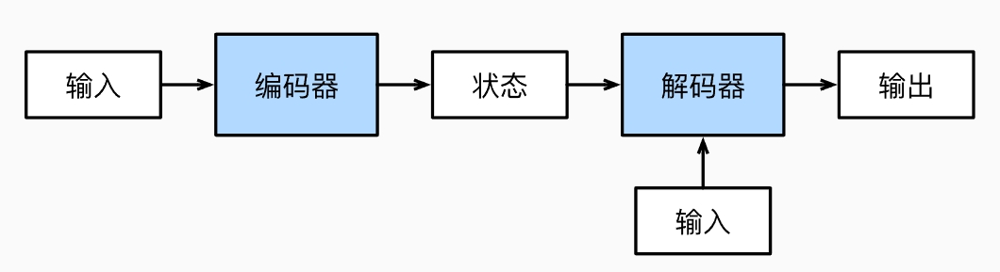
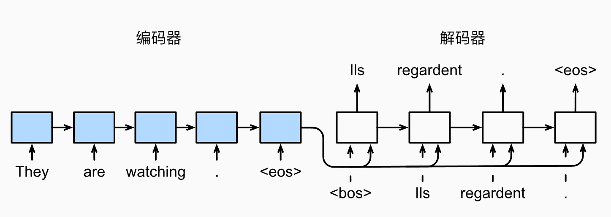
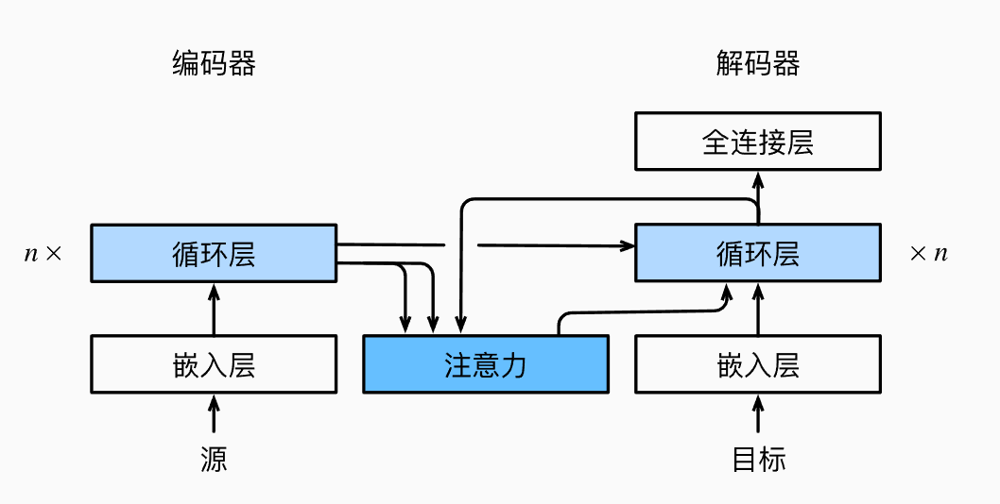
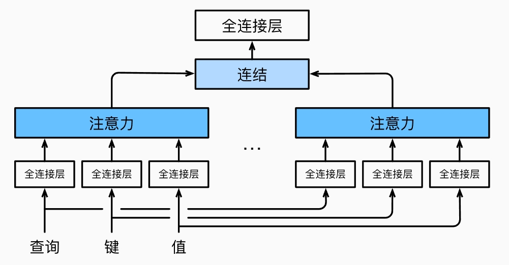
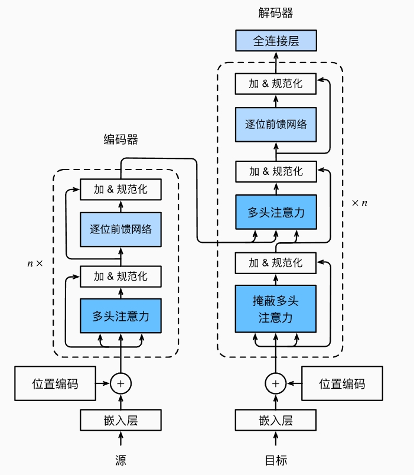

## 注意力提示

**人脑处理注意力的方式**：

你的视线中有几个不同的物品，每个物品的颜色形状等的不同，你的视线或者注意力会下意识地集中在更显眼的物品上，最终传入人脑的信息中关于这件物品的信息占比会更多；

如果你主动想找某个东西，那么你的注意力就会集中在跟你要找的东西更相关的物品上，最终获得每个物品的信息和在每个物品投入的注意力相关。


**查询、键和值**：

视线中每个物品都自带信息，这些信息就相当于感官输入，称为**值**（value）。

每个物品本身会不同程度地吸引你的注意力，即非自主性提示，称为**键**（key），反映物品的非自主性提示的程度。值与键是配对的。

你想找某个东西的信息，主动调节或分配每个物品上的注意力，即自主性提示，称为**查询**（query）。

查询（自主性提示）和键（非自主性提示）相结合称为注意力汇聚，它表示每个物品上分配到的注意力，即注意力权重，可以看成是查询与每个键之间的关联程度。


“是否包含自主性提示”是注意力机制与全连接层或汇聚层的最大区别。


## 注意力汇聚

注意力汇聚公式：
$$
f(x)=\sum_{i=1}^{n}\alpha(x,x_i)y_i
$$
其中，$x$是查询，$(x_i,y_i)$是键值对，$\alpha(x,x_i)$是注意力权重，可以看成一个概率分布，$\sum_i\alpha(x,x_i)=1$。

不同的汇聚方式对应不同的注意力模型。


**平均汇聚**：$\alpha(x,x_i)=1/n,\ \ i=1,\cdots,n$。（==不属于注意力模型==）


**Nadaraya-Watson 核回归**（非参数注意力汇聚）：
$$
\alpha(x,x_i) = \frac{K(x-x_i)}{\sum_{i=1}^n K(x-x_i)},
$$
其中，$K$是核，通常考虑的是高斯型的核，$K(u)=\exp(-u^2/2)$，则可以得到，
$$
\alpha(x,x_i) = \text{softmax}(-\frac{1}{2}(x-x_i)^2).
$$
如果注意力权重$\alpha(x,x_i)$中带有可学习参数，则是带参数注意力汇聚。


## 注意力评分函数

设查询为$q$，键值对为$\{(k_i,v_i)\}_{i=1}^m$，基本所有的注意力汇聚中，注意力权重$\alpha$都是采用高斯型，即
$$
\alpha(q,k_i)=\text{softmax}(a(q,k_i)),
$$
其中，$a(q,k_i)$称为注意力评分函数，选择不同的注意力评分函数会导致不同的注意力汇聚操作。


常见的注意力评分函数：1.掩蔽softmax操作，2.加性注意力评分函数，3.缩放点积注意力评分函数。


## Bahdanau 注意力

Bahdanau 注意力是使用“加性注意力评分函数”的注意力模型。

核心是通过一个可学习的评分函数，衡量当前解码器隐藏状态与每个编码器隐藏状态之间的相似性（相关性）。


**编码器-解码器（Encoder-Decoder）**



如上图，在传统的编码器-解码器架构中：

- 编码器将整个输入序列编码成一个固定长度的向量，通常是最后一个隐状态，即图中的“状态”；
- 解码器用上一步得到的上下文向量作为**初始状态**，一步一步生成目标序列。


我们以机器翻译为例子，演示模型是如何将英文`They are watching.`翻译成法文`Ils regordent.`。



1. 编码器中主要使用了RNN（循环神经网络），我们将英文中的单词依次输入进模型中，其中`<eos>`是最后一个输入，表示告诉模型我们的输入已经结束。

2. 每输入一次，RNN中的隐状态会更新，模型中间不进行输出，最终模型的隐状态是一个固定长度的向量，我们称为**上下文变量**，它包含了所有输入的信息，模型将它输出给解码器。

   ```css
   x1 → x2 → x3（输入）
   ↓    ↓    ↓
   h1   h2   h3（最终隐状态，上下文变量）
   ```

   

3. 解码器中也是主要使用了RNN，上一步得到上下文变量将会作为解码器的初始隐状态，我们将前一个已生成的词输入进编码器中，模型将输出翻译结果。

   ```css
   使用 h3 初始化隐状态
   z1   z2(=y1)   z3(=y2)（输入，即前一个已生成的词）
   ↓      ↓        ↓
   s1     s2       s3      （隐状态）
   ↓      ↓        ↓
   y1     y2       y3
   ```

   

4. 解码器的输入中，`<bos>`是第一个输入，表示告诉模型可以开始翻译；模型的第一个输出的结果`lls`将作为第二个输入，依次类推，直到模型输出`<eos>`，表示翻译完成。

需要注意的是，在训练时候，我们的数据是有已经翻译好的结果，为了有效率地训练模型，解码器的输入是按翻译结果（标签）依次输入，而预测时候是用上一个结果作为输入。


**问题**：固定长度的向量很难承载所有输入信息，尤其是输入很长时，容易信息“压缩”丢失。


**解决**：使用注意力机制（Attention）。不再强迫 decoder 只依赖一个固定的上下文变量，而是让解码器**在生成每个词时都能动态地查看整个输入序列的所有隐藏状态**，并选择最重要的部分。

-------


**解码器-编码器 + Bahdanau 注意力**



基本架构如上图，这次以中译英为例子，“我 今天 吃 饭”--->“I eat today”。

**编码器**：使用RNN处理输入序列，并把每次输入的隐状态进行记录并输出，传给解码器。

```css
x1 → x2  → x3  → x4
我   今天   吃    饭
↓     ↓     ↓     ↓
h1    h2    h3    h4     ← 隐状态，编码器输出
```

**解码器**：

1. 解码器的初始隐状态可以选用$h_4$（编码器最后一个隐状态）或者一个可学习的向量。
2. 解码器使用注意力机制，将解码器当前的隐状态$s_i$作为查询，编码器的所有隐状态作为键值对$\{(h_j,h_j)\}$。
3. 当前输入$z_i$（即上一个输出结果），编码器所有的隐状态$\{h_j\}$和当前隐状态$s_i$一起共同作用，产生输出$y_i$。具体的计算步如下，
   - 计算注意力权重$\alpha(s_i,h_j)$，使用的是加性注意力评分函数。
   - 计算上下文变量$c_i$，它是注意力的输出，$c_i=\sum_j\alpha(s_i,h_j)h_j$。
   - 上下文变量$c_i$与当前输入$z_i$进行拼接，作为RNN的输入，RNN更新解码器的隐状态，并输出当前结果，$y_i=y_i(c_i,s_i)$。（后面还会接一个全连接层进行加工处理）。

==注意==：查询（query） 用的是上一个时间步 解码器(decoder) 的最后一层隐状态，而不是当前输入的词向量(embeding)。

解码器当前时间步的隐状态表示了“我目前的上下文状态”和“我要生成什么词的意图”是**对当前生成目标的最强表达**，最适合用来做注意力的查询；而输入的词向量只是某个单词本身的固定语义表示，没有上下文信息，只是某个单词本身的固定语义表示。

通俗地讲就是，如果你要去阅读并找到关键页，你肯定是根据你当前想写的句子（当前隐藏状态），而不是你手里拿着的一个单词去判断应该读哪页。


## 多头注意力

在实践中，当给定相同的查询、键和值的集合时， 我们希望模型可以基于相同的注意力机制学习到不同的行为， 然后将不同的行为作为知识组合起来， 捕获序列内各种范围的依赖关系。

注意力头设为$h$，它的计算方法为
$$
h=f(W^{(q)}q,W^{(k)}k,W^{(v)}v)
$$
其中$W$是可学习参数， 它将查询$q$、键$k$、值$v$投影到某个的子空间，相当于“关注”某个方向或方面。

在训练注意力模型过程，可学习参数$W$会逐渐改变，使得它关注比较正确的方向。


对于多头注意力，每个头设为$h_i$，计算方法为
$$
h_i=f(W_i^{(q)}q,W_i^{(k)}k,W_i^{(v)}v)
$$
初始时候，每个头的可学习参数$W_i$是不同的，投影到不同的子空间，即每个头关注了方向不一样。

最终的输出是将每个注意力头的输出拼接一起进行线性变换处理，如下图所示。




最终的输出综合了所有的注意力头，在训练优化过程中，每个头面对的梯度不同，这使得每个头之间保留有差异性。

多头注意力是拼接多个注意力头的输出，再投影到输出空间，而不是简单加权平均，这种方式可以更好地综合多个注意力头的特征，拥有更大的表达能力。

单头注意力相当于一个人；多头注意力相当于一个团队，团队里每个成员负责不同的东西。


## 自注意力和位置编码

如果注意力模型中的查询、键和值都来自同一组输入，则称为**自注意力**（self-attention）或内部注意力。

有时候输入序列的位置是很重要的，为了使用序列的顺序信息，可以通过了在输入表示中添加**位置编码**（positional encoding），来注入绝对的或相对的位置信息，通常使用的是基于正弦函数和余弦函数的固定位置编码。

假设输入序列为$X$，位置编码为$P$，两者的形状是一样的，则$X+P$就是带有位置信息的输入序列。


## Transformer

Transformer模型完全基于注意力机制，没有任何卷积层或循环神经网络层。





