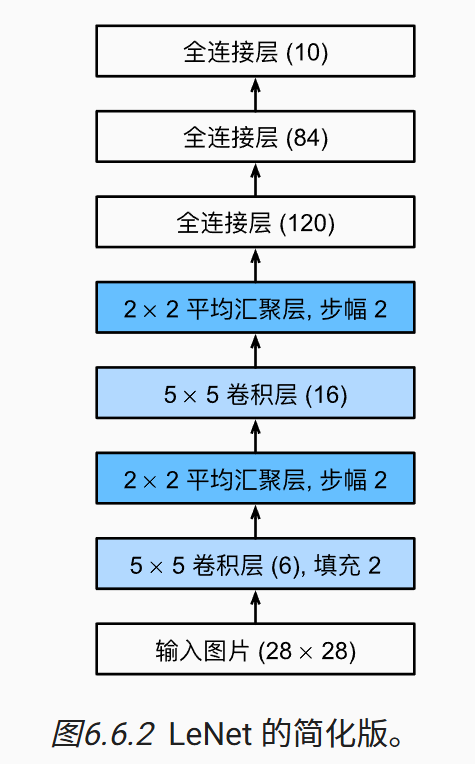

# 第六章 卷积神经网络

## 介绍

卷积神经网络（CNN）是一类强大、为处理图像数据而涉及地神经网络。

CNN需要的参数少于全连接神经网络，也很容易用GPU并行。

基本逻辑：我们想从一个巨大图像中找某个物品，可以使用一个“检测器”，该检测器只检查图像中的一小块区域，判断该区域包含所找物品的可能性；接着不断地平移该检测器，使之对图像中每个区域都进行了检测，最后综合所有检测的信息进行判断物品在哪。

1.平移不变性。上述中我们不断平移检测器，而检测器在每个区域的作用都是相同的，即判断在物品在区域内的可能性。

2.局部性。检测器每次只关注一块小区域。

数学形式

输入是二维图像，用矩阵$X$表示。第一层隐藏层的输出用矩阵$H$表示。

1.多层感知机
$$
\begin{align}
[H]_{i,j}&=[U]_{i,j} + \sum_k\sum_l[W]_{i,j,k,l} [X]_{k,l} \\
&= [U]_{i,j} + \sum_a\sum_b [V]_{i,j,a,b} [X]_{i+a,j+b} 
\end{align}
$$
$X$中的下标表示的是哪个位置的像素点，$H$的下标表示的是第一层隐藏层中哪个神经元的输出，$W$是权重，$U$是偏置。$V$也是权重，是以像素点为中心的权重，是$W$的平移，$[V]_{i,j,a,b}=[W]_{i,j,i+a,j+b}=[W]_{i,j,k,l}$。

2.平移不变性

因为每次检测作用是相同，所以平移过程中权重和偏置不变，即$[V]_{i,j,a,b}$和$[U]_{i,j}$不依赖于像素点位置$(i,j)$。可以进一步化简为，
$$
[H]_{i,j}=u + \sum_k\sum_l[V]_{a,b} [X]_{i+a,j+b}
$$
其中，对于所有$i,j$，有$[V]_{i,j,a,b}=[V]_{a,b}$ 和 $[U]_{i,j}=u$。

3.局部性

每次检测只检测一块区域，我们只需考虑区域范围内的权重。
$$
[H]_{i,j}=u + \sum_{a=-\Delta}^{\Delta}\sum_{b=-\Delta}^{\Delta}[V]_{a,b} [X]_{i+a,j+b}
$$
这样（有平移不变性和局域性）的隐藏层称为卷积层，卷积层权重 $V$ 称为**卷积核**或**滤波器**。

**通道**：一张彩色图像是由高度、宽度和颜色组成的三维张量，其中颜色就是通道，颜色由三原色（红绿蓝）表示，因此是3个通道。可以把三维张量看成一个个二维张量的叠加，叠加的方向就是通道维度方向，一个二维张量是一个通道。

因此，卷积层的一般表示为：
$$
[H]_{i,j,d} = \sum_{a=-\Delta}^{\Delta}\sum_{b=-\Delta}^{\Delta} \sum_c[V]_{a,b,c} [X]_{i+a,j+b,c}
$$
这里我们忽略了转置项，$c$是图像的通道，$d$表示输出通道，用于标记卷积核，专门识别某个模式。比如一个卷积核专门识别边缘，另一个卷积核识别纹理，每个卷积核输出一个二维张量，这一卷积层中不同的卷积核的输出叠加一起，就是一个三维张量。

## 卷积与互相关

**卷积**的数学定义：
$$
(f*g)(x) = \int f(z)g(x-z)\ \text{d}z
$$
可以看出，卷积是把核函数$g$翻转并位移$x$，然后测量 $f$ 和 $g$ 之间的重叠。

**互相关（cross-correlation）**的定义：
$$
(f\star g)(x) =\int f(z)g(x+z) \text{d}z
$$
与卷积的区别是，互相关没有对核函数$g$进行翻转。

对比前面的公式可以看到卷积核中使用的是互相关操作，出于习惯和历史原因，大家仍然叫它“卷积”。

在学习卷积核时，使用严格的卷积核或者互相关运算，卷积核层的输出不会受到太大的影响，两种运算得到的卷积核只差个翻转。

输入的尺寸大小为$n_h\times n_w$，经过一个大小为$k_h\times h_k$的卷积核运算之后，输出的大小为$(n_h-k_h+1)\times (n_w-k_w+1)$。

##  填充和步幅

使用卷积之后，得到的输出尺寸小于输入的，导致丢失原始图像的边缘信息。**填充**是解决此问题的最有效方法。

有时候希望大幅度减小图像的尺寸，例如原始的输入分辨率十分冗余。**步幅**是常用于处理该问题的手段。

**填充**：在输入图像边缘填充元素（通常填充元素是0）。

如果添加$p_h$行（一半在顶部，一半在底部），添加$p_w$列（一半在左侧，一半在右侧），则输出形状为$(n_h+p_h-k_h+1)\times (n_w+p_w-k_w+1)$。

通常我们取$p_h = k_h-1,p_w=k_w-1$，使得输入和输出具有相同的高度和宽度。

通常取卷积核的高度和宽度为奇数，这可以保证填充的行列是偶数，所有侧边的填充行数和列数相同，此时得到的输出$Y[i,j]$是通过以输入$X[i,j]$为中心、与卷积核进行互相关运算得到的。

在计算互相关时，卷积窗口从输入张量的左上角开始向下、向右滑动。每次滑动元素的数量称为**步幅**。

通常，当垂直步幅为$s_h$、水平步幅为$s_w$时，输出形状为，
$$
[(n_h+p_h-k_h+s_h)/s_h]\times [(n_w+p_w-k_w+s_w)/s_w]
$$

在实践中，我们使用一致的步幅或填充，即$p_h=p_w=p$，称填充为$p$，$s_h=s_w=s$，称步幅为$s$。

默认情况下，填充为0，步幅为1。

## 多通道

当输入包含多个通道时，需要构造一个具有与输入数据相同的通道数的卷积核，以便进行互相关运算，得到的输出只有一个通道。

如果输入通道为$c_i$，我们想要输出通道为$c_o$，则我们需要创建$c_o$个形状为$c_i\times k_h\times k_w$的卷积核张量，则卷积层或该层卷积核的形状为$c_o\times c_i \times k_h \times k_w$。

## 汇聚层（池化层，pooling layer）

机器学习任务通常会跟全局图像的问题相关，例如图像中是否包含一只猫，因此在处理图像时，我们希望逐渐减小特征图（隐藏表示）的空间分辨率，聚合整个信息，为此引入了**汇聚层**。

**汇聚层**的作用：

- 降低特征图尺寸，减少计算量。
-  增加感受野。特征图缩小间接增加了后续神经元对更大区域的感知能力。
- 增强特征的不变性（尤其是平移不变性），使得小范围的输入平移或形变不会改变输出的结果或只引起微小变化，具有鲁棒性。
- 防止过拟合。丢弃了一些局部信息，减少了模型对局部细节的过拟合。

与卷积层类似，**汇聚层**是由一个固定形状的窗口（称为汇聚窗口）组成，根据步幅大小在输入区域上滑动。

汇聚层可以通过填充和步幅获得所需要的输出形状。

与卷积层不同的是，汇聚层的参数是确定，不用来学习。

汇聚层的操作是确定性的，通常我们计算汇聚层窗口中所有元素的最大值或平均值，分别称为最大汇聚和平均汇聚。

在处理多通道输入数据时，汇聚层在每个输入通道上单独运算，这意味着汇聚层的输出通道数与输入通道数相同。

汇聚层与卷积层：

**卷积层：** 是一种“特征检测器”，负责“看见”图片中哪里有什么。

**汇聚层：** 是一种“信息摘要器”，负责“总结”哪些区域有重要信息。

## LeNet卷积神经网络

LeNet是最早发布的卷积神经网络之一。

LeNet（LeNet-5）由两个部分组成：

- 卷积编码器：由两个卷积层组成;
- 全连接层密集块：由三个全连接层组成。

每个卷积块中的基本单元是一个卷积层和平均汇聚层（使用ReLU和最大汇聚层会更有效）。

每个卷积层使用$5\times 5$卷积核和一个sigmoid激活函数（先进行卷积核操作再进行激活函数处理）。

将卷积块的输出传递给稠密块时，我们需要在小批量中展平每个样本。

 