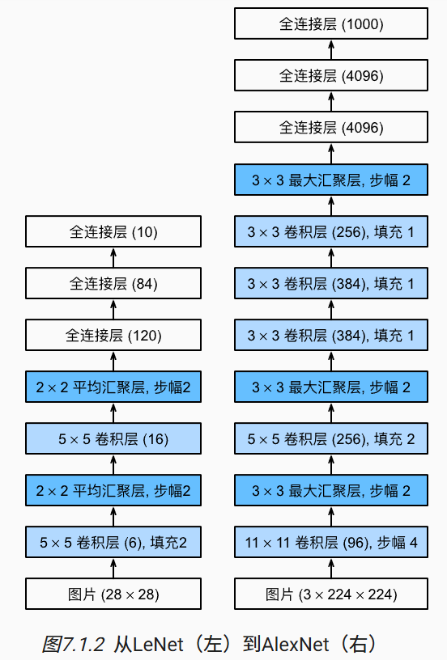
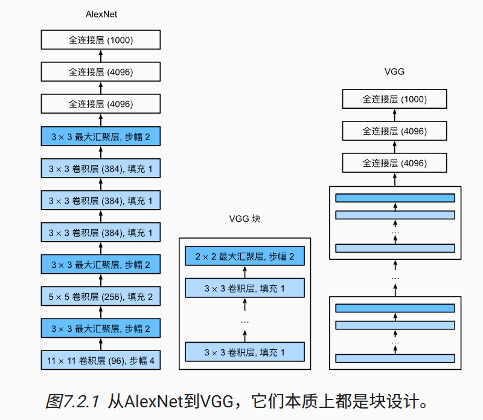
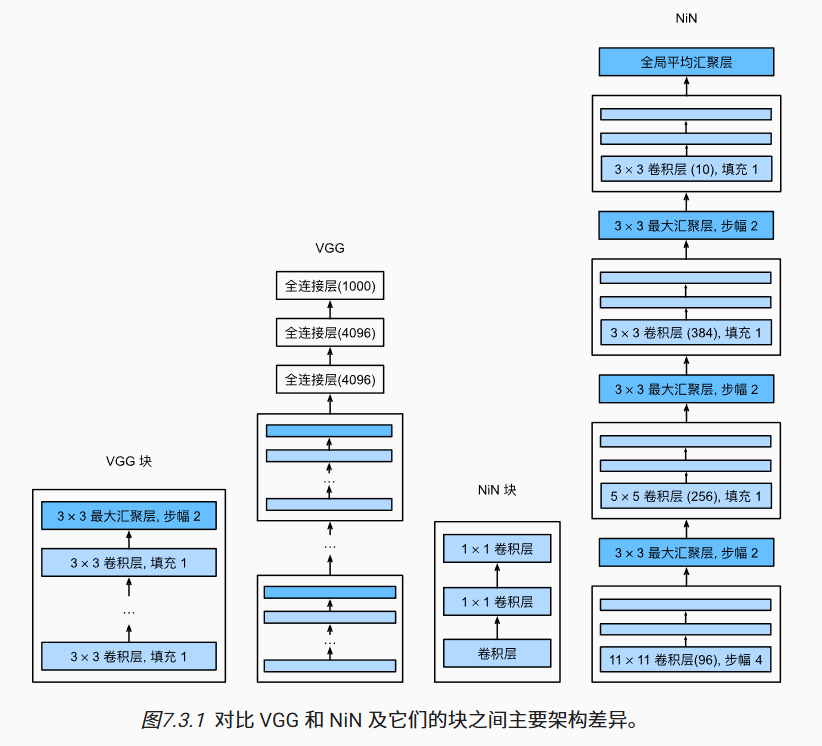
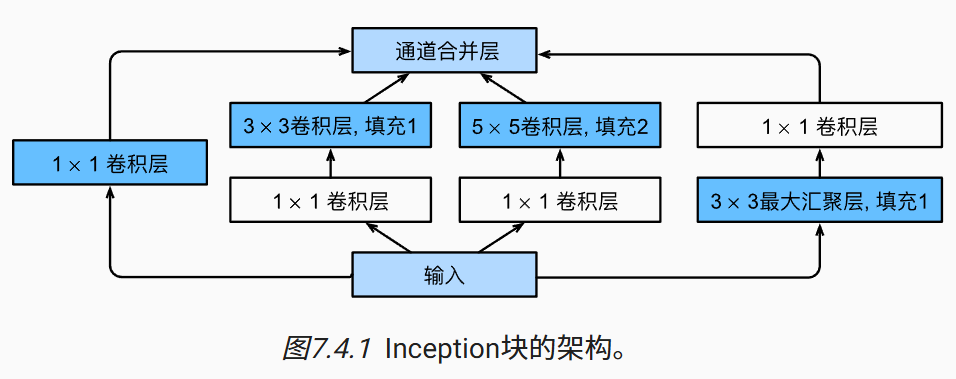
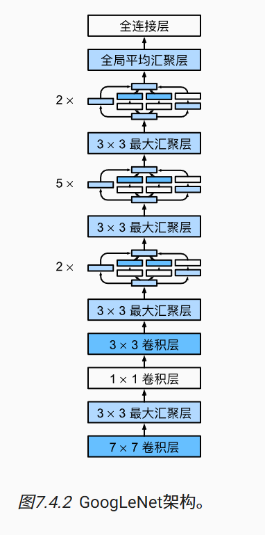
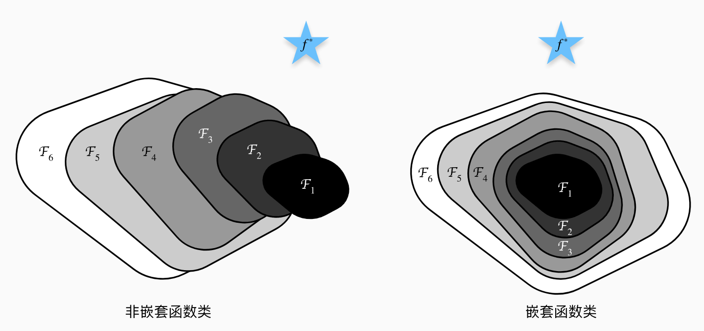
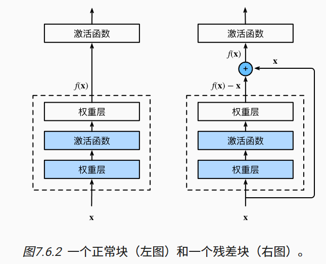

# 第七章 现代神经网络

## AlexNet深度卷积神经网络

深度卷积神经网络的突破出现在2012年，突破归功于一下两个因素：

- **数据**：深度模型需要大量有标签的数据才能显著优于传统的方法，这一状况在2012年左右兴起的大数据浪潮中得到改善。
- **硬件**：深度学习对计算资源要求很高，用GPU训练神经网络解决了这个问题。原因是GPU拥有CPU数量更多、更节能的内核，内存带宽更高。

AlexNet：2012年横空出世，它是第一个在大规模视觉竞赛中击败传统计算机视觉模型的大型神经网络，首次证明了学习到的特征可以超越手动设计的特征。

下面是精简版本的AlexNet：

AlexNet和LeNet的架构非常相似，但也有区别：

1. AlexNet要更深。AlexNet由八层组成：五个卷积层、两个全连接隐藏层和一个全连接输出层。
2. AlexNet使用ReLU而不是sigmoid作为其激活函数，避免梯度消失，训练模型更加容易。
3. AlexNet通过暂退法控制全连接层的模型复杂度，而LeNet只使用了权重衰减。
4. AlexNet在训练时增加了大量的图像增强数据，如翻转、裁切和变色。
5. AlexNet使用了GPU进行训练。

注意：卷积神经网络中默认经过卷积层之后会经过激活函数处理，所以网络架构图中不会特意写激活函数。

## VGG（使用块的网络）

使用块的想法是牛津大学的视觉几何组（VGG）提出的。

经典卷积神经网络的组成部分是：卷积层、激活函数 和 汇聚层。

VGG网络可以分为两部分：第一部分是是由VGG块组成，第二部分由全连接层组成。

VGG块与经典卷积神经网络类似，它由一系列的卷积层，再加上用于空间降采样的最大汇聚组成。

不同的VGG模型可通过每个块中的卷积层数量和输出通道数量的差异来定义。

## NiN（网络中的网络）

之前介绍的三个模型，LeNet、AlexNet和VGG都有共同的设计模式：通过一系列的卷积层与汇聚层来提取局部空间的结构特征；然后通过全连接层对特征的表征进行处理，完成“分类”任务。

AlexNet和VGG的主要改进在于如何扩大和加深这两个模块。

**困难**：使用全连接层会将输入的特征图进行展平（flatten），从而丢失了特征图的空间结构。

**解决**：NiN（网络中的网络）通过在每个像素的通道上分别使用多层感知机，即$1\times 1$卷积层解决。

**NiN思想**：在每个像素位置应用一个全连接层，相当于$1\times 1$卷积层。从另一个角度看，相当于将空间维度中的每个像素视为单个样本，将通道维度视为不同特征。

NiN网络组成：NiN块+汇聚层。汇聚层插在多个块中间，并不是每个块后面都有。最后是使用全局平均汇聚层生成一个对数几率作为输出。

最后使用全局平均汇聚层代替全接连层，显著减少了参数数量，也减少了过拟合。

NiN块的组成：一个普通卷积层，两个$1\times 1$卷积层。这两个$1\times 1$卷积层充当带有ReLU激活函数的逐像素全连接层。

NiN块与VGG块的区别：

- VGG块是卷积层 + 汇聚层，目的是特征提取 + 缩小空间基本单元
- NiN块是普通卷积层 + $1\times 1$卷积层，不包含汇聚层，理由是NiN网络更关注**在每个空间位置上增加表达能力 **，NiN块是“增强局部表达”的模块，如果每个块都做进行汇聚，会导致空间分辨率不够，可能会丢信息。

NiN和AlexNet最显著区别：NiN完全取消了全连接层。

NiN设计的优点：显著减少模型所需要的参数数量。

例子：假设你有一个输入通道数为 256，输出为 512 的 1x1 卷积，只需要 256×512 = 131072 个参数。

缺点：实践中，这种设计会增加训练模型的时间。

原因是1x1 卷积计算密集，使得计算瓶颈转移到通道维度，并行效率低，梯度传播更复杂。

NiN架构图：

## GoogLeNet（含并行连接的网络）

问题：简单地堆叠卷积层或加宽网络，会带来两个问题：

1. **计算量大、参数太多**（尤其是用大卷积核时，3x3、5x5 都很耗）
2. **深度增加可能导致梯度消失/训练困难**

GoogLeNet 出现于2014年，吸收了NiN中串联网络的思想，并在此基础上做了改进。

GoogLeNet 使用不同大小的卷积核组合，**在计算效率和模型表达能力之间取得了平衡**，解决了什么样大小的卷积核最合适的问题。 

在GoogLeNet中，基本的卷积块被称为 Inception块（模块内多路径并行卷积）。

如上面Inception块架构图所示，Inception块由四条并行路径组成，分别从不同空间大小中提取信息：

1. **1×1 卷积**：用于降维和引入非线性（计算轻，保持细节）
2. **1×1 卷积 + 3×3 卷积**：先降维（减少通道数）再做大卷积（降低计算量）

2. **1×1 卷积 + 5×5 卷积**：同理，先降维后做大感受野操作

3. **3×3 最大池化 + 1×1 卷积**：提取局部信息后，增加非线性通道组合

然后将这四条路径的输出在**通道维度上拼接（concat）**，形成模块的输出。

在Inception块中，通常调整的超参数是**每层输出通道数**。

Inception块中使用并行的好处是：

1. **不同大小的卷积核可以捕捉不同感受野的特征**
2. 用池化路径补充特征的鲁棒性

GoogLeNet架构图：

在Inception块之间使用最大汇聚层可以降低维度。

最后先全局平均汇聚层再使用全连接层，避免直接使用全连接层导致空间信息的丢失。

GoogLeNet 的核心是 Inception 模块 —— 用多个并行卷积路径来提取不同尺度的特征，同时通过 1x1 卷积降维，降低计算量，从而实现更高效的深度卷积网络。

## 批量规范化（batch normalization）

**问题背景**：深层网络训练过程中，前一层参数更新会导致后一层输入分布不断变化，这种现象称为**内部协变量偏移**，它会导致训练时梯度消失/爆炸、收敛慢、对学习率敏感，从而使得深度神经网络难以训练。

**批量规范化（BN）的核心思想**：在每一层送入激活函数前，把特征做归一化处理（均值为0，方差为1），然后再进行缩放和平移，使之稳定在某个分布上。

**目标**：稳定每一层输入的分布，让训练更快、更稳定，更容易调参。

**具体步骤**：

假设有一个小批量，该小批量在某一层的输出记为 $\mathbf{x}=(x_1,\cdots,x_d)^\top$，构成的集合记为$B$，我们对集合中元素$\mathbf{x}$的每个特征维度$x_i$做如下处理：

1. 针对当前批量$B$，计算每个特征维度的均值和方差：
   $$
   \mathbf{\mu_B} = \frac{1}{|B|}\sum_{\mathbf{x}\in B} \mathbf{x},\\
   \mathbf{\sigma_B} = \frac{1}{|B|}\sum_{\mathbf{x}\in B}(\mathbf{x} - \mathbf{\mu_B})^2
   $$
   其中$\mathbf{\mu_B}=(\mu_{B1},\cdots,\mu_{Bd})^\top,\mathbf{\sigma_B}=(\sigma_{B1},\cdots,\sigma_{Bd})^\top$。

2. 归一化处理：
   $$
   \mathbf{y} = \frac{\mathbf{x}-\mathbf{\mu_B}}{\sqrt{\mathbf{\sigma_B} + \epsilon}}
   $$
   上式是逐元素操作，其中$\epsilon>0$是一个很小的常数，确保分母不会为0。

3. 缩放和平移（学习参数）：
   $$
   \textbf{BN}(\mathbf{x}) = \mathbf{z} = \gamma \odot \mathbf{y} + \beta
   $$
   其中记批量规范化的运算符为$\textbf{BN}$，$\odot$是逐元素相乘，拉伸参数$\gamma=(\gamma_1,\cdots,\gamma_d)$和偏移参数$\beta=(\beta_1,\cdots,\beta_d)$是可学习参数，用于恢复网络的表达能力。。

因为每个特征维度代表不同的含义和作用，为了避免破坏每个特征自身的尺度与结构，使模型难以学习，所以每个特征各自进行批量规范化，即每个特征有相应的均值、方差和拉伸参数、偏移参数。

**使用位置**：

理论上BN放在激活函数之后或者之前都是可以的，但主流实践都是放在前面，即先进行BN操作再进行激活函数。

**训练模式的BN**：

在训练模式下，我们无法使用整个数据集来估计均值和方差，所以只能根据每个（当前）小批量的均值和方差不断训练模型。

**测试模型的BN**：

在训练阶段，BN会维护一个“滑动平均”版本的全局均值和方差，通过多个 batch 累计滑动平均 估计全局均值和方差。

预测时用的是“训练期间累计估计出来”的全局均值与方差。

**全连接层的BN**：

全连接层的BN是对每个特征维度分别进行批量规范化处理，如上面给出的。

全连接层的BN使用`nn.BatchNorm1d`。

**卷积层的BN**：

卷积层有多个通道，每一个通道代表一种特征图，为了不破坏特征图的空间结构，并且保持每个特征图各自之间的分布稳定，卷积网络稍微不同于全连接网络（上面给的步骤）的方式。

特征图包含的信息是整体的，为了保持特征图的空间结构，我们不能单独处理每个像素点，而是对整个特征图的所有像素点一起进行处理，计算均值和方差。而不同的特征图包含的特征信息是不同的，因此不同通道是要分别进行批量规范化的，每个通道拥有独自的拉伸参数$\gamma$和偏移参数$\beta$。

假设一个卷积层输出维度是：`(batch_size, num_channels, height, width)`，BN 会对每个通道 `c` 计算：
$$
\mu_c = \frac{1}{N\cdot H\cdot W}\sum_{i=1}^N\sum_{h=1}^H\sum_{w=1}^W x_{i,c,h,w}
$$
BN 把每个通道当作一个单位，在 batch 内做归一化。

卷积层的BN使用`nn.BatchNorm2d`。

**BN带来的的好处**：

- 更快收敛。因为梯度更稳定，训练快。
- 更高准确率。因为减少了梯度爆炸/消失问题。
- 不那么依赖初始化。BN具有和初始化一样有稳定每层输入输出的作用。
- 可以使用更大学习率，更容易调参。
-  有轻微正则化效果。因为因为 mini-batch 归一化引入了噪声。

## ResNet（残差网络）

**深层网络的困境**：我们直觉上认为，网络越深 → 表达能力越强 → 效果越好；但事实是网络太深时，反而训练误差变大、效果更差（哪怕没有过拟合）

**原因**：简单来说，深层网络在逼近恒等映射时都很难。如下图所示，随着网络深度增加，模型表达能力增强，但是复杂深度的模型不一定包含浅层模型的解，如图中左侧$\mathcal{F}_1\not\subseteq \mathcal{F}_6$，这就使得复杂网络可能比简单网络更偏离真实解。

**解决**：一个简单的想法是，在增加网络深度时，如果新增加的层可以训练成恒等函数，那么随着深度的增加，网络所能表达的函数类是嵌套的，如上图右侧。

**ResNet 的核心思想**：每个附加层都应该更容易地包含原始函数作为其元素之一，即包含恒等映射。

具体来说，假设希望得到的函数是$H(x)$，网络块所表达的函数为$f(x)$，普通网络的输出就是$f(x)$，经过训练后有$H(x)=f(x)$；而残差网络的输出选择为$f(x)+x$，经过训练后有$H(x)=f(x)+x$，也就是说残差中网络块学习的函数是$f(x)=H(x)-x$。残差网络很容易实现恒等映射，只要网络块中权重和偏置都设置为0即可。

残差块与正常块的架构图如下：

**注意**：这样的设计要求网络块的输出$f(x)$ 与 输入$x$ 形状相同，从而使得它们可以相加。比如，当通道数不同时，可以引入一个额外的$1\times 1$卷积层来改变输入的通道数。

残差网络除了使用残差块，在每个卷积层之后增加了批量规范化层。

## DenseNet（稠密连接网络）

DenseNet 是对 ResNet 的进一步发展与改进，提出了一个更加激进的特征复用机制，帮助训练更深但更高效的神经网络。

**ResNet** 的想法是加一个“恒等跳跃连接” $y=F(x)+x$，让梯度可以绕过当前层，避免梯度消失。ResNet 的残差连接只是“加法”地复用了输入**。**

**DenseNet** 提出：既然老的特征有用，那就**不要加起来**，我们**直接拼接所有前面层的输出特征作为输入**！这样，每一层都可以直接访问前面所有层的输出，特征不但传得远，而且不会被压缩，特征复用更彻底；梯度能从任意后面一层直接传到任意前面一层，梯度传播更顺畅。

**DenseNet**主要由下面部分组成：

**1. 稠密链接**

在普通网络中，第 $l$ 层只接收 $l-1$ 层的输出：
$$
x_l = H_l(x_{l-1})
$$
在 DenseNet 中，第 $l$ 层接收 **所有之前层的输出拼接**：
$$
x_l = H([x_0, x_1, \cdots, x_{l-1}])\\
[x_0, x_1, \cdots, x_{l-1}] = [x_0, H(x_0), H([x_0,H(x_0)]),\cdots]
$$
其中，$[x_0, x_1, \cdots, x_{l-1}]$ 表示在通道维度上拼接。

**2. 稠密块**

**稠密块**：块内部的每一层都与块内所有前面层进行稠密连接（通道拼接），块的**整体输出**就是块内所有层的输出拼接。

**3. 过渡层**

由于每个稠密块会不断增加通道数（因为一直拼接），为了控制模型规模，在两个稠密块之间通过一个“过渡层”连接。

**“过渡层”**：使用$1\times 1$卷积来减少通道数；使用平均汇聚层（池化层）减小特征图的空间尺寸。

**5. 最后连接全局汇聚层和全连接层输出结果**

**ResNet与DenseNet的区别**：

新添加的一层如果是冗余的，ResNet 会把添加层可以退化为恒等映射而不影响性能；

DenseNet 无法直接退化为恒等映射，但它靠小通道、BN 缩放、后续层学习，把无用的“冗余层”变得影响很小，从而实现间接的“容错能力”。

