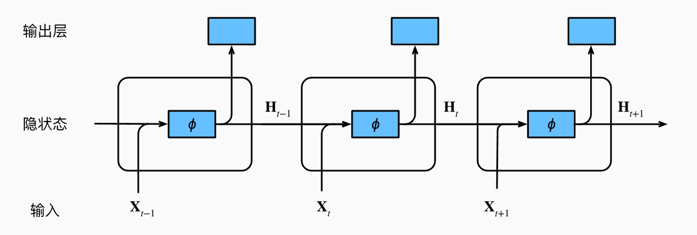
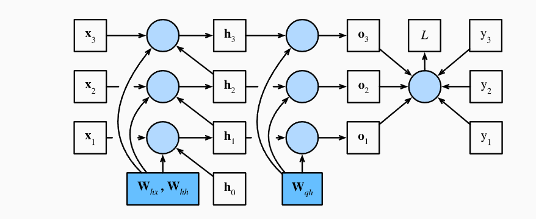

# 第八章 循环神经网络

## 序列

**序列数据**：具有**时间或顺序依赖性**的数据。核心特性是，当前的输出不仅依赖当前输入，还可能依赖历史的输入。

## 文本预处理

文本预处理步骤：

1. 读取数据集：将文本作为字符串加载到内存中；
2. 分词：将字符串拆分为**词元（token）**；
3. 词表构建：建立一个**词表（vocabulary）**，将拆分的词元映射到数字索引序列；
4. 编码文本序列：将文本转换为数字索引序列，以方便模型操作。

## 语言模型

目标：构建一个**语言模型**，根据序列中之前的词源，预测序列中**下一个词元**的概率分布；

**建立语言模型**：

给定一个长度为 $T$ 的序列，$[x_1,\cdots, x_T]$；我们希望模型学习出，
$$
P(x_1,\cdots,x_T)=P(x_1)\cdot P(x_2|x_1)\cdots P(x_T|x_1\cdots x_{T-1})
$$
这种对自身进行回归，一步一步预测下一个词元的模型称为自回归模型。

**训练**

为了训练模型，我们需要两个东西：

- 输入序列：词元索引构成的序列。
- 目标序列（标签）：输入序列右移一个词元得到的。

训练的目标是让模型能从输入序列预测出目标序列。

**构造样本对**：

假设我们已经将一个很长的 文本 转换成 词元索引列表 ，如`[1, 5, 2, 3, 6, 7, ...]`。

如果我们想构建训练集训练模型，那就得从这个长序列里**不断地切片，切出多个固定长度的输入序列**，比如每段 5 个字符，然后构造对应的目标序列（右移一位）。

问题：要从哪里开始切出输入序列？下一段输入序列接在哪里？

**采样策略**

采样策略决定了我们从长文本中如何生成多个输入-目标样本对。

假设 `corpus = [0, 1, 2, 3, 4, 5, 6, 7, 8, 9]`。

1. 随机采样：每次从任意位置随机抽出一段长度为 `num_steps` 的序列作为输入。

   特点：打乱时间顺序，样本独立。

   随机采样得到样本之间没什么联系，例如：

   - `X1 = [2, 3, 4, 5] → Y1 = [3, 4, 5, 6]`
   - `X2 = [0, 1, 2, 3] → Y2 = [1, 2, 3, 4]`

2. 顺序采样：从头开始，**按顺序**一段段分割。

   特点：时间连续性好，适合模拟真实序列生成过程。

   顺序采样得到样本是连续的、顺序的，例如：

   - `X1 = [0, 1, 2, 3] → Y1 = [1, 2, 3, 4]`
   - `X2 = [4, 5, 6, 7] → Y2 = [5, 6, 7, 8]`

**困惑度（Perplexity）**

数学公式：
$$
\text{Perplexity} = \exp\left( -\frac{1}{N}\sum_{i=1}^N \log P(x_i) \right)
$$
其中，$x_i$表示第$i$次预测的正确答案，$P(x_i)$表示第$i$次预测中正确答案的概率，$-\log P(x_i)$可以看作是第$i$次预测的交叉熵损失。

困惑度：衡量语言模型在N次预测中模型的不准确度。

模型预测越准确，困惑度越小，越接近1。

模型越“迷惑”（越不确定），困惑度越大，直至无穷。

## 循环神经网络

全连接神经网络和卷积神经网络：假设输入是“独立同分布”的样本，不擅长处理“前后关联”的数据。

**RNN 的基本动机**：设计一种结构，让“过去的信息”可以传到“现在”来参与决策。

**RNN 的结构设计**：每个时刻有一个“隐状态”（hidden state）$H_t$，当前的输出由当前输入 $x_t$ 以及上一个时刻的隐状态 $H_{t-1}$ 共同决定，如下图所示。

**数学形式**：

对于时间步 $t$，输入是 $x_t$，上一个隐状态是 $H_{t-1}$，更新公式为：
$$
H_t = \phi(W_{xh}x_t + W_{hh}h_{t-1} + b_h) \\
o_t = W_{ho}H_t + b_o
$$
其中，$W_{xh}$是输入到隐藏层的权重；$W_h$是上一个隐状态传给当前隐状态的权重；$h_t$是当前时刻的“记忆”；$o_t$是输出，用来做预测。

所有时间步共享相同的权重 $W_{xh}, W_{hh}, W_{ho}$。

**使用RNN构建语言模型**：

## 循环神经网络的实现

前面我们把词元表示为数字索引，直接将数字索引输入给神经网络是很难训练学习的，通常的做法是**将词元或者数字索引表示为更具有表达力的特征向量**，比如通过独热编码的方式。

**预热**：在进行预测的时候，我们首先把输入传入模型，让模型不断地将隐状态传递到下一个时间步，但是不产生输出，这个过程称为预热期。预热期结束后，隐状态的值通常更适合预测。

**训练中隐状态的初始化**：

每个批量里样本是并行计算的，隐状态是“批量隐状态”张量，共享初始化隐状态。**每一条样本序列都有自己独立的记忆**，这些记忆是并行存储的

不同批量之间则根据采样策略决定是否初始化：

随机抽样：**每个小批量都要重新初始化状态**，因为批量之间的训练样本没有自然顺序，我们无法依赖上一个批量的状态。

顺序抽样：此时批量内部样本是独立的，但是批量顺序是固定的，且批量之间存在联系，相邻批量的第$i$个样本（同一位置的样本）之间是顺序关系，因此，只有最开始的时候需要初始化，之后都不需要初始化。

注意：在每个 epoch 的开始（或每条序列的起始）仍然需要初始化隐状态。

## 通过时间反向传播（BPTT）

BPTT 是循环神经网络（RNN）中进行 **梯度计算和权重更新** 的算法，是普通 **反向传播（BP）** 在时间维度上的扩展。

我们把 RNN 看成一个在 **时间上展开的神经网络**，如下：

在每个时间步 $t$：

- 输入是 $x_t$
- 隐状态是 $h_t = f(x_t, h_{t-1}, w_h)$，为了方便，用$w_h$替代$w_{hx},w_{hh}$。
- 输出是 $o_t=g(h_t,w_o)$，为了方便，用$w_o$替代$w_{qh}$。
- 标签是 $y_t$

训练的目标是最小化**所有时间步的总损失**：$L=\frac{1}{T}\sum_{i=1}^T l(o_t,y_t)$

**梯度分析**：
$$
\frac{\partial L}{\partial w_h} = \frac{1}{T}\sum_{i=1}^T \frac{\partial l}{\partial o_t}\frac{\partial o_t}{\partial h_t}\frac{\partial h_t}{\partial w_h}
$$
然而$\frac{\partial h_t}{\partial w_h}$是递归的，
$$
\frac{\partial h_t}{\partial w_h} = \frac{\partial f(x_t, h_{t-1}, w_h )}{\partial w_h} + \frac{\partial f(x_t, h_{t-1}, w_h )}{\partial h_{t-1}}\frac{\partial h_{t-1}}{\partial w_h}
$$
把递归展开得到：
$$
\frac{\partial h_t}{\partial w_h} = \frac{\partial f(x_t, h_{t-1}, w_h )}{\partial w_h} + \sum_{i=1}^{t-1}\left( \prod_{j=i+1}^t \frac{\partial f(x_j, h_{j-1}, w_h )}{\partial h_{j-1}}\right) \frac{\partial f(x_i, h_{i-1},w_h)}{\partial w_h}
$$
里面包含了**梯度累乘**，从而导致：

- **梯度爆炸（>1 的乘积快速变大）**

- **梯度消失（<1 的乘积快速变小）**

**解决方法**：

**截断时间步**：$\frac{\partial h_t}{\partial w_h}$的展开式中，求和指标$i$是从 $i=1$ 到 $i=t$，现在我们只考虑最近的 $\tau$ 时间步，则求和变成从 $i=t-\tau+1$ 到 $i=t$。

从原先 $\frac{\partial h_t}{\partial w_h}$ 的表达式可以知道，$h_t$ 是包含了前 $t$ 时间步$\{h_1,\cdots, h_t\}$的信息，而**截断时间步**则是认为 $h_t$ 是只包含了最近 $\tau$ 时间步$\{h_{t-\tau+1},\cdots, h_t\}$的信息，“忘记”了更长时间$\{h_1,\cdots,h_{t-\tau}\}$的信息。