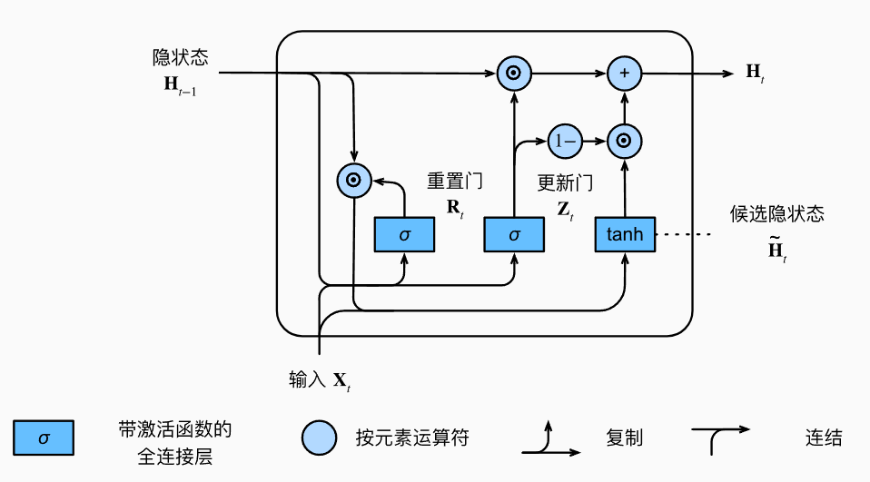
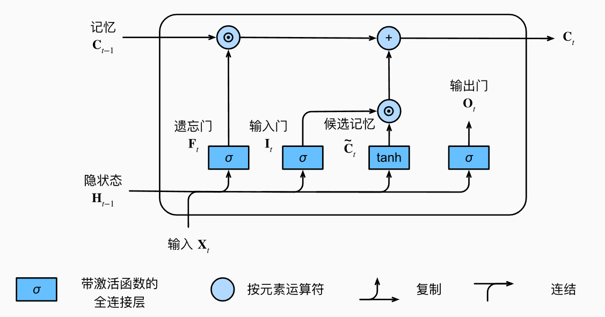
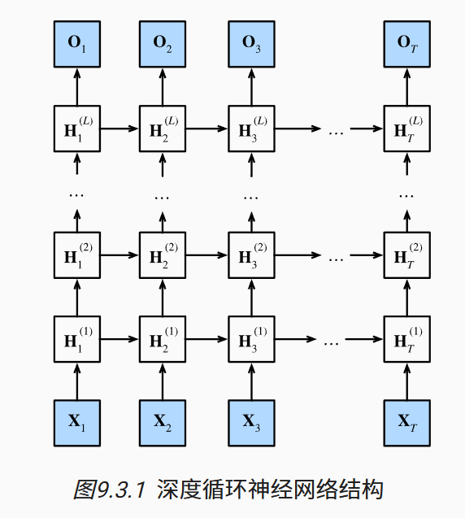
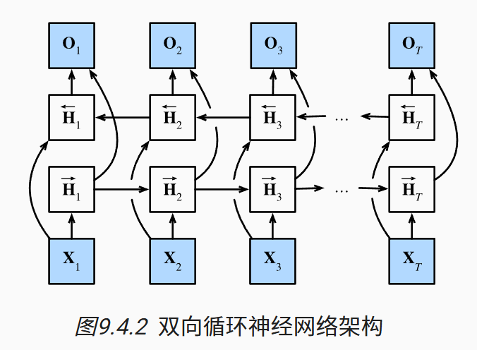
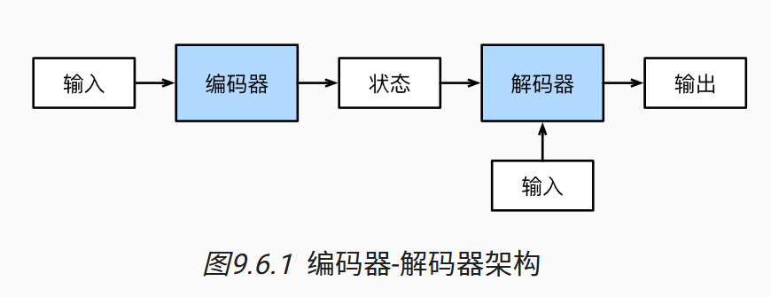
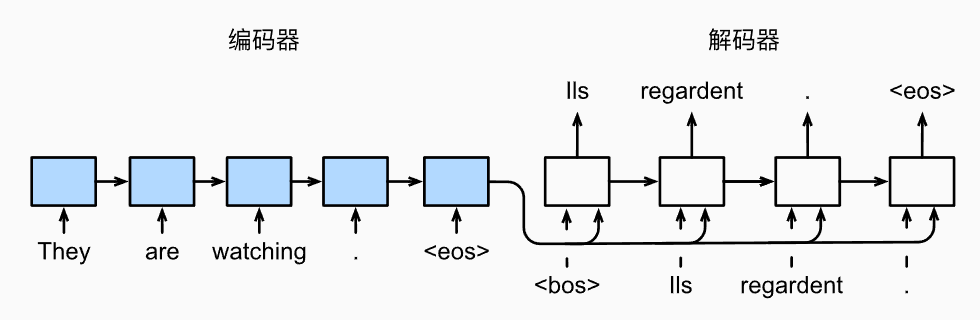

# 第九章 现代循环神经网络

循环神经网络在实践中一个常见问题是数值不稳定性。 尽管我们已经应用了梯度裁剪等技巧来缓解这个问题， 但是仍需要通过设计更复杂的序列模型来进一步处理它。

## 门控循环单元（GRU）

门控循环单元与普通的循环神经网络之间的关键区别在于： 前者支持隐状态的门控。 这意味着模型有专门的机制来确定应该何时更新隐状态， 以及应该何时重置隐状态，这些机制是可学习的。

### **GRU的核心思想**

GRU 通过**门控机制**控制信息的流动，从而实现有效的长期记忆。它包含两个主要的门：

- **更新门（update gate）**$z_t$：控制了**新旧信息如何组合形成最终记忆**，或者说当前状态中保留多少过去的记忆。
- **重置门（reset gate）**$r_t$：控制了过去信息是否参与“新候选信息”计算，或者说允许我们控制“忘记”多少过去的记忆。

### **GRU的计算公式**

设输入为 $x_t$，前一时刻的隐藏状态为 $h_{t−1}$，当前时刻的候选隐藏状态为$\tilde{h}_t$，当前时刻的隐藏状态为 $h_t$。

首先，根据输入为 $x_t$ 和前一时刻的隐藏状态 $h_{t−1}$ 计算该时刻的更新门$z_t$ 和重置门$r_t$ ：
$$
z_t = \sigma(W_{xz} x_t + W_{hz} h_{t-1} + b_z) \\
r_t = \sigma(W_{xr} x_t + W_{hr} h_{t-1} + b_r)
$$
其次，根据重置门计算该时刻的候选隐藏状态：
$$
\tilde{h}_t = \tanh (W_{xh} x_t + W_{hh} (r_t \odot h_{t-1}) + b_h)
$$
重置门的输出 $r_t$ 决定计算候选隐藏状态时有多大程度依赖于过去的信息，是否对过去信息进行重置。

最后，根据更新门计算该时刻的隐藏状态：
$$
{h}_t = (1-z_t)\odot h_{t-1} + z_t \odot \tilde{h}_t
$$
更新门的输出 $z_t$ 决定多大程度上用候选隐藏状态来更新当前时刻的隐藏状态，即是否要“记住”当前时刻带来的“记忆”。

其中，$\sigma$ 表示sigmoid函数，$\odot$ 表示Hadamard积（逐元素乘法）, $W$ 表示可学习的权重参数，$b$ 表示可学习的偏置参数。

门控循环单元具有以下两个显著特征：

- 重置门有助于捕获序列中的短期依赖关系；
- 更新门有助于捕获序列中的长期依赖关系。

## 长短期记忆网络（LSTM）

长短期记忆网络（Long Short-Term Memory, LSTM）比GRU更早提出，也更复杂一些。

传统 RNN 和 GRU 都只用一个隐状态 ${h}_t$ 来承载记忆，梯度在反向传播中通过太多非线性变换会逐步消失（或爆炸），难以保留早期信息，导致模型“记不住长距离依赖”。

**LSTM的核心思想**：

LSTM 通过引入**记忆元**和**三个门控机制**，实现了对信息流动的**精细控制**，由于记忆元在结构上不做非线性变换，从而解决了 RNN 无法建模长期依赖的问题。

- **记忆元**：简称单元，可以认为是一种特殊类型的隐状态，用于存储长时记忆。
- **遗忘门（forget gate）** ${f}_t$：决定保留多少过去的信息；
- **输入门（input gate）** ${i}_t$：决定写入多少当前的新信息；
- **输出门（output gate）** ${o}_t$：控制从单元状态中输出多少内容。

**LSTM 的计算流程**：

给定当前输入 $x_t$、前一时刻隐藏状态 ${h}_{t-1}$、前一时刻单元状态 ${c}_{t-1}$。

1. 门控机制计算：
   $$
   i_t= \sigma(W_{xi}x_t + W_{hi}h_{t-1} + b_i) \\
   f_t = \sigma(W_{xf}x_t + W_{hf}h_{t-1} + b_f) \\
   o_t = \sigma(W_{xo}x_t + W_{ho}h_{t-1} + b_o)
   $$

2. 候选单元状态：
   $$
   \tilde{c}_t = \tanh(W_{xc} x_t + W_{hc}h_{t-1} + b_c)
   $$

3. 根据遗忘门、输入门和候选单元，更新记忆元：
   $$
   c_t= f_t\odot c_{t-1} + i_t\odot \tilde{c}_t
   $$

4. 根据输出门和当前时刻的记忆元，更新隐藏状态：
   $$
   h_t = o_t \odot \tanh(c_t)
   $$

其中，$W$是可学习权重参数，$b$是可学习偏置参数。

**结构说明**：

**单元状态** $c_t$：用于长期记忆，稳定保存序列中的“关键信息”，主要通过遗忘门和输入门更新，不直接输出。

**隐状态** $h_t$：表示当前时间步中用于预测的有效信息，通过输出门控制。（==输出门的作用是筛选有用的信息，避免记忆元中一些无用的信息也传给隐状态，过多无用的信息容易导致过拟合==）

所有门使用 **sigmoid** 激活，输出在 [0,1] 范围，表示“允许程度”；

候选状态使用 **tanh** 激活，输出在 [−1,1]。

## 深度循环神经网络

之前考虑都是单层的神经网络，只需简单地将循环神经网络堆叠在一起就可以得到深度循环神经网络。深度门控循环神经网络和深度长短期记忆神经网络也是类似得到。

下面是一个具有 $L$ 个隐藏层的深度循环神经网络：

## 双向循环神经网络

**背景**：很多任务中，当前输出不仅依赖**过去**，也依赖**未来**。例如，词性标注必须根据上下文的信息确定。

**解决**：引入双向循环神经网络。

**双向循环神经网络（Bidirectional RNN）** 是在标准 RNN 的基础上，将序列**同时从前往后（正向）和从后往前（反向）**进行处理：

正向 RNN：从 $t = 1 \to t=T$，处理历史信息；

反向 RNN：从 $t = T \to t=1$，处理未来信息；

最终输出：两个方向的输出拼接或求和后作为当前时刻的表示。

**计算流程**：

对于任意时间步t，给定一个小批量的输入数据$x_t$，令隐藏层激活函数为$\phi$。

1. 正向递归和反向递归的隐状态更新：
   $$
   \overrightarrow{h_t} = \phi(W_{xh}^{(f)} x_t + W_{hh}^{(f)} \overrightarrow{h}_{t-1} + b_h^{(f)}) \\
   \overleftarrow{h_t} = \phi(W_{xh}^{(b)} x_t + W_{hh}^{(b)} \overleftarrow{h}_{t-1} + b_h^{(b)})
   $$
   正向更新和反向更新是同时并且独立进行的。

2. 拼接两个方向的隐藏状态，得到每个时刻 $t$ 的最终隐状态：
   $$
   h_t = [\overrightarrow{h}_t; \overleftarrow{h}_t]
   $$

3. 在具有多个隐藏层的深度双向循环神经网络中， 该信息（最终隐状态）作为输入传递到下一个双向层。

4. 计算输出层：
   $$
   o_t = W_{ho}h_t + b_o
   $$

**优势**：利用未来了的信息。

**限制**：

由于需要**完整的前后序列**，双向 RNN **不适用于在线（实时）任务**，但它**非常适合离线任务或文本处理**。

双向循环神经网络的计算速度非常慢。 其主要原因是网络的前向传播需要在双向层中进行前向和后向递归， 并且网络的反向传播还依赖于前向传播的结果。 因此，梯度求解将有一个非常长的链。

## 编码器-解码器架构

编码器-解码器结构是对 RNN 系列模型的结构性封装与提升，用于实现“一个序列 → 另一个序列”的复杂任务，比如机器翻译。

**结构概览**：

编码器（Encoder）：它接收一个长度可变的序列 $x_1,\cdots,x_T$ 作为输入，使用 RNN（如 GRU/LSTM）处理整个序列，将其转换为具有固定形状的编码状态（称为上下文变量$c$）。

解码器（Decoder）：根据固定形状的编码状态（上下文变量$c$）逐步生成长度可变的目标序列 $y_1,\cdots, y_T$，使用的也是RNN模型。

## 序列到序列学习（seq2seq）

基于“编码器–解码器”结构，构建一个最基础的 Seq2Seq 模型，并用于机器翻译任务。

**计算流程**：

**编码器**：

1. 使用嵌入层，将输入序列中的词元转换为特征向量或词嵌入向量，得到序列$x_1,\cdots,x_T$。

   注意：序列的最后一个词元为终止符`<eos>`，表示序列结束词元。

2. 将序列 $x_1,\cdots,x_T$ 按时间步输入给编码器，得到每个时间步的隐状态：
   $$
   h_t = f(x_t,h_{t-1})
   $$

3. 编码器通过选定的函数 $q$， 将所有时间步的隐状态转换为上下文变量 $c$：
   $$
   c = q(h_1,\cdots,h_T)
   $$
   一般选择最后时间步的隐状态作为上下文变量，即 $q(h_1,\cdots,h_T)=h_T$。

**解码器**：

1. 嵌入层将上一个时间步的输出词索引或词元转换成对应的词嵌入向量 $y_{t'-1}$。

2. 将上下文变量 $c$ 和 上一个时间步的输出 $y_{t'-1}$ (或标签 $\hat{y}_{t'-1}$ ）作为解码器的输入，得到每个时间步的隐状态（用$s$表示）：
   $$
   s_{t'} = g(y_{t'-1},c,s_{t'-1})
   $$
   注意：

   - 预测时输入选择 $y_{t'-1}$，训练时输入选择标签 $\hat{y}_{t'-1}$ 。
   - 初始时刻，解码器的输入是起止符`<bos>`，表示序列开始词元。
   - 解码器的隐状态初始化选择为上下文变量 $c$ 或编码器最后时间步的隐状态 $h_T$，即$s_1=c$ 或 $s_1=h_T$ 。

3. 输出层中使用全连接层，将隐状态和softmax操作结合，得到时间步 $t'$ 的输出词元 $y_{t'}$ 的概率分布 $P(y_{t'}|y_1,\cdots,y_{t'-1},c)$ ，最终的输出是词的索引或词元。

**训练机制（强制教学）**：

在训练阶段，解码器每一步的输入不是它自己预测的上一个词 $y_{t'-1}$，而是**真实标签中上一个词** $\hat{y}_{t'-1}$，这样可以提高准确率，加速训练收敛，减少误差传播。

**损失函数**：

- 每一步解码器输出 $y_t$ 与真实 $\hat{y}_t$ 进行交叉熵损失计算；
- 所有时间步的损失求和，计算整个句子的预测误差。
- 通常为了保证序列长度一致，会对序列长度短的进行填充（padding），计算损失时，使用掩码（mask）过滤填充的部分。

**模型评估**：

BLUE是一种常用的评估方法，它通过测量预测序列和标签序列之间的$n$元语法（n-gram）的匹配度来评估预测。

==比较复杂，这里不展开。==

**缺点**：当输出序列很长时，只用一个固定的上下文变量表达整句话的信息是很困难的，会导致信息压缩损失严重，解码器“记不住”前面的输入信息。

## 束搜索